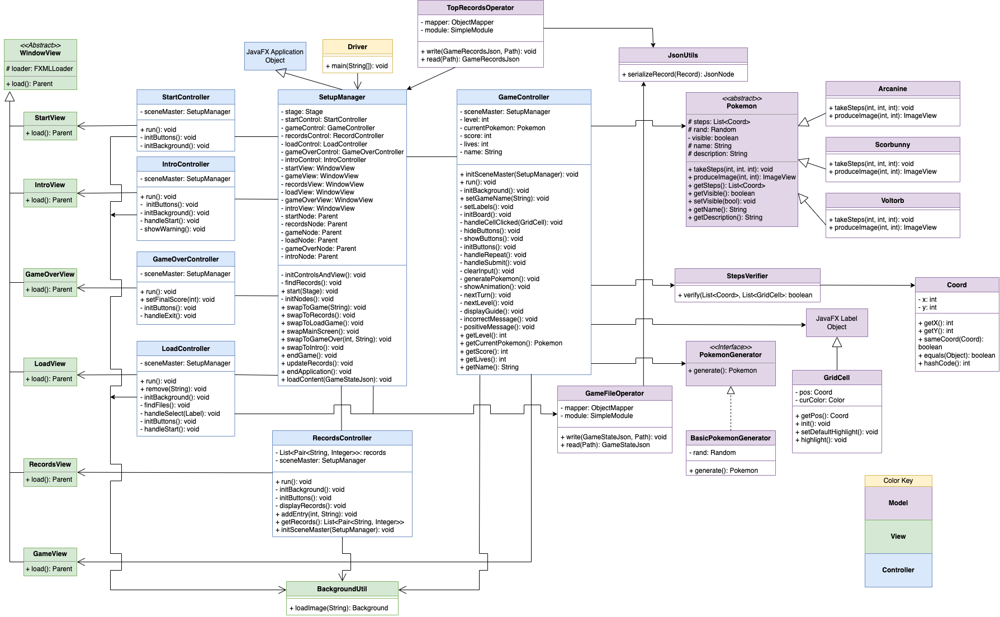

# Find That Pokemon!
## Description
A Pokémon-themed memory game inspired by Simon Says. The objective is to observe various Pokémon's tile patterns and retrace their steps. The player must exactly match the pattern, but can replay the active Pokémon's steps at any time. The game is over when the player enters an incorrect sequence three times. Each successful user input increases the next sequence length of the next Pokémon by one.  
## Features
1. Various Pokémon with differing behaviors
- Scorbunny: A rabbit who enjoys jumping around on random tiles on the board
- Voltorb: A ball Pokémon who prefers to roll around on adjacent tiles
- Arcanine: A canine Pokémon who loves running in straight lines
2. Persistence: Save an ongoing game at any time
- Clicking the SAVE & EXIT button on the game screen will automatically save the game
3. Load Game: Reopen any game that has been saved
- Allows for multiple save files to exist at once
- Only valid for games that have lives remaining
- After the player reaches game over, the save file cannot be reopened
4. Top Records: View previous top records
- A record's entry name is determined by the name of the save file the user first enters when starting a new game
- The entry gets recorded only after reaching the game over screen
- Only the top 5 records are recorded
## Credits
Background drawings for each scene were made by me using Piskel. Images of each Pokémon came from their respective Serebii sites:
- Scorbunny: https://www.serebii.net/pokedex-swsh/scorbunny/
- Voltorb: https://www.serebii.net/pokedex-swsh/voltorb/
- Arcanine: https://www.serebii.net/pokedex-swsh/arcanine/

Scenes/FXML files were made using SceneBuilder.
## UML Diagram

## Known Bugs/Ongoing Objectives
- There is a bug with the hashcode method for determining if two cell grids are the same
- Unit testing for JavaFX objects

